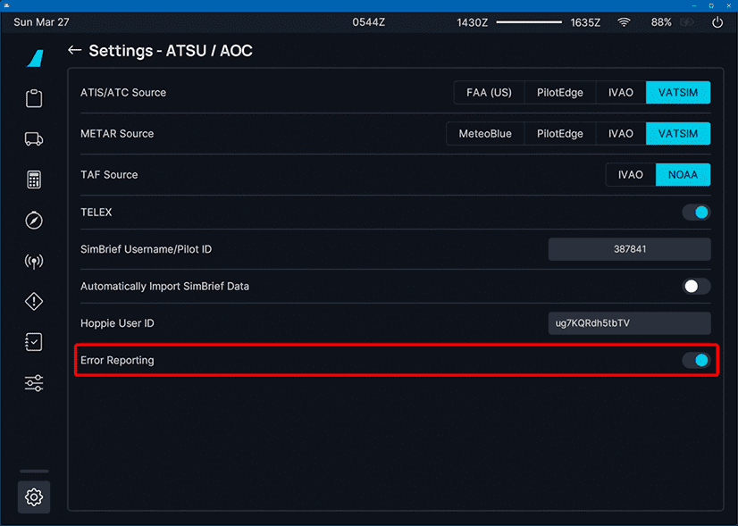

# Recommended Settings

This page aims to list a few recommended settings for the Microsoft Flight Simulator, Windows and the A32NX itself before and while using the FlyByWire A32NX.

If you are new to the FlyByWire A32NX please also make sure to read the [A32NX Beginner Guide](../pilots-corner/beginner-guide/overview.md) especially [Preflight](../pilots-corner/beginner-guide/preflight.md).

## Microsoft Flight Simulator Settings

### Use DX11

Use of DX11 is recommended for best performance due to an issue with some glass cockpit technologies in the DX12 version of the simulator. This is not an FBW issue and we cannot address it for now - please keep in mind DX12 is officially a "beta feature" and thus should not be used unless you know what you are doing.

{loading=lazy}

### Graphics Settings

Turn off the `Lens Correction` setting in the Graphics settings page.

If you do not deactivate it it will be harder to click and move switches, knobs and buttons in the cockpit.

Set the `Glass Cockpit Refresh Rate` to `Medium` or `Low` to avoid unnecessary display calculations which might cause fps loss.

{loading=lazy}

### Deactivate MSFS Assistance Features

A warning will be displayed if you have certain AI assistance features turned on. Please ensure you have disabled them.

!!! tip ""
    Having any AI features or assistance features switched on created some stability issues with our custom systems:

    - A/THR failing to arm or activate.
    - Engines turning off in-flight or after takeoff.
    - Constant right or left rudder.
    - Inability to taxi.

<!--{loading=lazy}-->

??? tip "Verify Settings"
    You can verify the assistance and AI features are switched off by checking the following settings.

    {loading=lazy}

    {loading=lazy}

### Legacy Cockpit Interaction System

We recommend the legacy (previous) method of the Cockpit Interaction System (Menu > General Options > Accessibility).

{loading=lazy}

### Controllers

{==

Sensitivity settings are highly hardware depended and can be different for each controller. The below recommendations are therefore initial starting points and it might be necessary to adapt these for your controller and your preference.

==}

#### Sidestick / Joystick

We **highly recommend** to use a joystick or flight stick when flying any aircraft in a simulator. Keyboard or controller buttons simply do not have the range and sensitivity required for successfully controlling an aircraft.

For the flight stick pitch control (up/backward and down/forward) we recommend using a sensitivity setting of `-30%` to better simulate the increased force you need to **push or pull** the real sidestick in the aircraft. Please see the screenshot below for an example:

{loading=lazy width=30%}

For roll (left or right) use what you think is best for you. The above mentioned -30% is a good starting point.

#### Rudder/Tiller

For the rudder, which by default also controls the nosewheel in MSFS, we recommend a little bit of sensitivity although linear should also work fine.

On the Development version if you have an extra axis on your controllers (e.g. twisting joystick while rudder is on pedals) you can separate the nosewheel steering via tiller from the rudder inputs. See [Nosewheel Tiller Separation](feature-guides/nw-tiller.md).

#### Throttle

Throttle should have linear sensitivity.

See [Throttle Calibration Guide](feature-guides/flyPad/throttle-calibration.md).

### Keyboard Mapping for Pause Function

Make sure that the `Pause` function is only mapped to the ++esc++ key and not to any other key as otherwise this mapped 
key will trigger `Pause` in input fields of the EFB or the MCDU when using the keyboard input mode. 

## Windows Settings

### UTF8 Support

Some users experience problems with various system in the A32NX. These are caused by an issue within MSFS which requires to use the UTF8 Region setting in Windows.

- Open Windows Control Panel -> Region.
- Go to the Administrative tab and click Change system locale
- Make sure the check mark next to Beta: Use UTF-8 for worldwide language support is selected.
- Click OK and ~~restart your computer~~.

{loading=lazy}

### Performance Settings

See [Performance Tips](support/performance-tips.md)

## Important A32NX Settings

### Installation With FBW Installer

Always use the FlyByWire Installer to install and update the A32NX add-on.

See our [Installation Guide](installation.md).

### Throttle

Our Custom Autopilot implementation requires that the throttle is calibrated to be able to correctly recognize the detents the A320 autoflight system relies on.

See [Throttle Calibration Guide](feature-guides/flyPad/throttle-calibration.md)

### Error Reporting

While using our aircraft you can help us to identify errors by turning on Error Reporting. This is completely optional and anonymous.

With Error Reporting enabled, any severe error in any display of the aircraft (e.g. flyPad, MCDU, PFD, ND, etc.) will create a log entry with our issue tracking system. This will help our development team to see these issues and get some important details to hopefully identify what caused the error.

This will speed up finding and fixing both issues and bugs significantly.

{==

You can decide to activate or deactivate this at any time in the flyPad EFB.

==}

The first time you start the aircraft after this feature has been included and also everytime you enable Error Reporting you will see a confirmation dialog where you need to click on `Yes`.

flyPad EFB Settings for Error Reporting:

